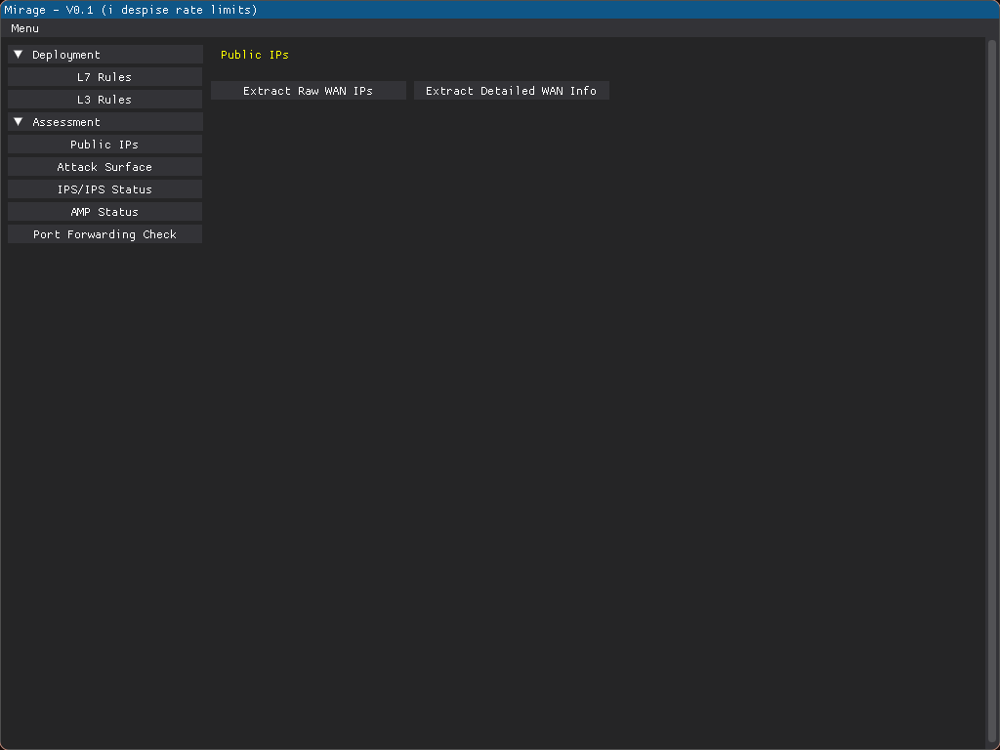

# M.I.R.A.G.E: Meraki Infrastructure Rapid Automation and Governance Engine

A modern cross-platform GUI tool for security, deployment & auditing of Cisco Meraki appliances.



## Install
```
git clone https://github.com/summoningshells/mirage.git
cd mirage
python -m venv venv
source venv/bin/avtivate
pip install meraki dearpygui
python3 mirage.py
```


## Features
- Modern, simple, cross-platform GUI interface (Windows, macOS, Linux)
- Deploy changes to MX appliances across different networks simultaneously:
    - L7 Firewall rules
    - L3 Firewall rules from csv
    - Content Filtering(Comming Soon)
- Security Auditing capabilities:
    - Extract all public IPs from all your appliances across all networks (even when using multiple WAN's)
    - Lookup IPs via Censys or Shodan to identify exposed ports and assets
    - Check IDS (Intrusion Prevention System) status and configuration across all appliances
    - Check AMP (Advanced Malware Protection) status and configuration across all appliances
    - Check Unescure Port Forwarding configs


## Security Features & Phylosophy
- Zero persistent storage of sensitive data 
- No telemetry collection
- Secure API communication
- Minimal dependencies (only 2 libs: meraki & dearpygui)

## Related Resources
- [Cisco Meraki Dashboard API Documentation](https://developer.cisco.com/meraki/api-v1/)
- [Official Meraki API Python Library](https://github.com/meraki/dashboard-api-python)
- [Meraki Automation Scripts](https://github.com/meraki/automation-scripts)


## Contributing
Contributions are welcome! Please feel free to submit pull requests. i am not a dev and i suck at making pretty GUI's 


## Limitations
- Works only for a single organisation since its my use-case and the multi organisations api operations are hell D: (rate limits are too strong)
- inputing the api every time you use the app can be a bit cumbersome

## License

MIT License

Copyright (c) 2024 SummoningShells

Permission is hereby granted, free of charge, to any person obtaining a copy
of this software and associated documentation files (the "Software"), to deal
in the Software without restriction, including without limitation the rights
to use, copy, modify, merge, publish, distribute, sublicense, and/or sell
copies of the Software, and to permit persons to whom the Software is
furnished to do so, subject to the following conditions:

The above copyright notice and this permission notice shall be included in all
copies or substantial portions of the Software.

THE SOFTWARE IS PROVIDED "AS IS", WITHOUT WARRANTY OF ANY KIND, EXPRESS OR
IMPLIED, INCLUDING BUT NOT LIMITED TO THE WARRANTIES OF MERCHANTABILITY,
FITNESS FOR A PARTICULAR PURPOSE AND NONINFRINGEMENT. IN NO EVENT SHALL THE
AUTHORS OR COPYRIGHT HOLDERS BE LIABLE FOR ANY CLAIM, DAMAGES OR OTHER
LIABILITY, WHETHER IN AN ACTION OF CONTRACT, TORT OR OTHERWISE, ARISING FROM,
OUT OF OR IN CONNECTION WITH THE SOFTWARE OR THE USE OR OTHER DEALINGS IN THE
SOFTWARE. 
