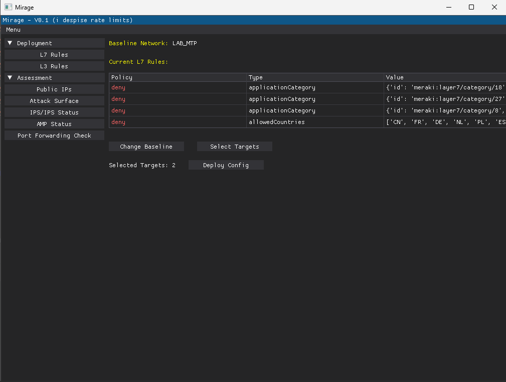

# M.I.R.A.G.E: Meraki Infrastructure Rapid Automation and Governance Engine
A simple cross-platform GUI tool for security, deployment & auditing of Cisco Meraki MX appliances.

# Install 
## install and use natively anywhere
```
git clone https://summoningshells/mirage.git
cd mirage
pip install requirements.txt
python3 mirage.py
```

## Install in virtual env

### Linux/Unix/Mac OS virtual env
```
git clone https://github.com/summoningshells/mirage.git
cd mirage
python -m venv venv
source venv/bin/avtivate
pip install meraki dearpygui
python3 mirage.py
```
### Windows virtual env
```
git clone https://github.com/summoningshells/mirage.git
cd mirage
python -m venv venv
venv\Scripts\activate
pip install meraki dearpygui
python3 mirage.py
```

# Features
- Minimalist, simple, cross-platform GUI interface (Windows, macOS, Linux)
- Deploy changes to MX appliances across different networks simultaneously:
    - L7 Firewall rules (clone config from a baseline network to thousands in 3 clicks)
    - L3 Firewall rules from/to csv 
    - Content Filtering (clone config from a baseline network to thousands in 3 clicks)
- Security Auditing capabilities:
    - Extract all public IPs from all your appliances across all networks (even when using multiple WAN's)
    - Lookup IPs via Censys or Shodan to identify exposed ports and assets (Coming Soon)
    - Check IDS (Intrusion Prevention System) status and configuration across all appliances
    - Check AMP (Advanced Malware Protection) status and configuration across all appliances
    - Check Unsecure Port Forwarding configs (no Source IP restrictions) 



# Security Features & Philosophy
- Zero persistent storage of sensitive data 
- No telemetry 
- Secure API communication
- Minimal dependencies with buisness friendly licenses (only 2 libs: meraki & dearpygui)

# Related Resources
- [Cisco Meraki Dashboard API Documentation](https://developer.cisco.com/meraki/api-v1/)
- [Official Meraki API Python Library](https://github.com/meraki/dashboard-api-python)
- [Meraki Automation Scripts](https://github.com/meraki/automation-scripts)


# Contributing
Contributions are welcome! Please feel free to submit pull requests. i am not a dev and i suck at making pretty GUI's 


# Limitations
- Works only for a single organisation since its my use-case and the multi organisations api operations are too restricted API wise
- inputing the api every time you use the app can be a bit cumbersome
